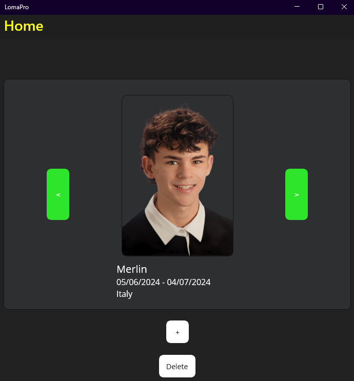
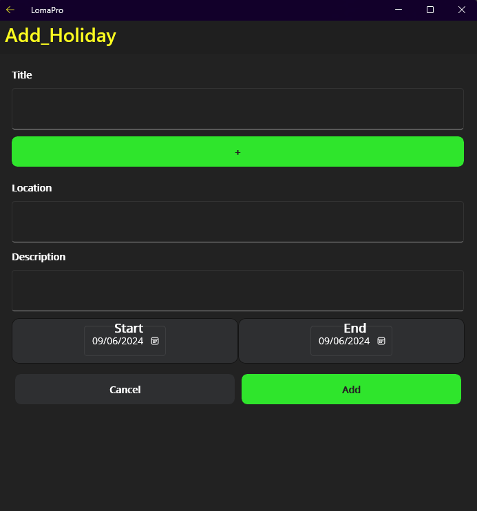
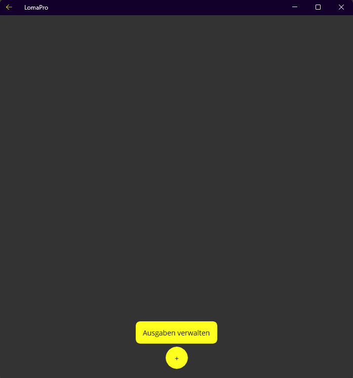
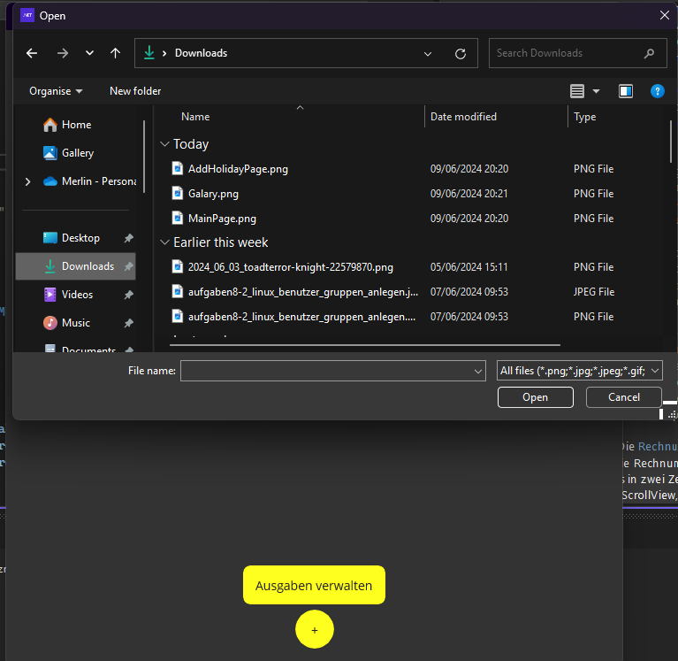
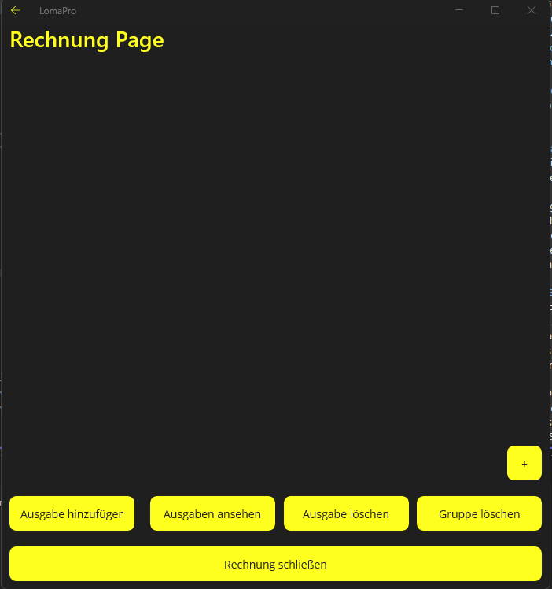
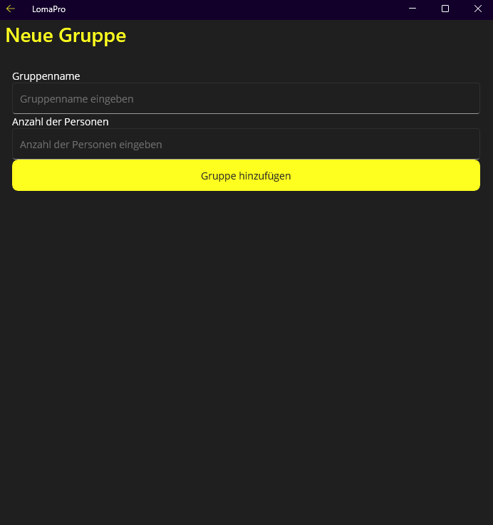
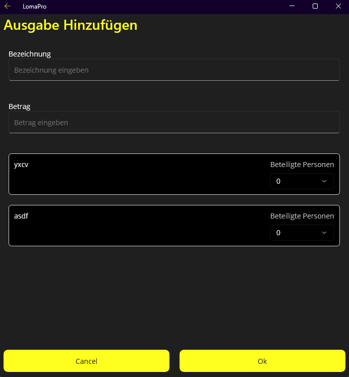
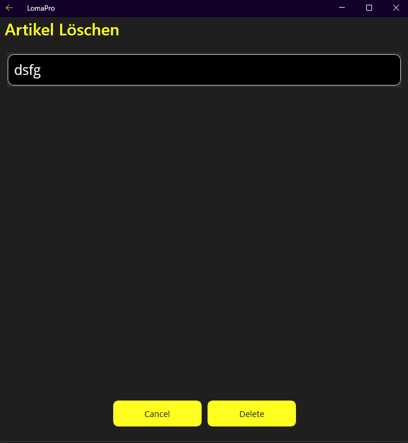
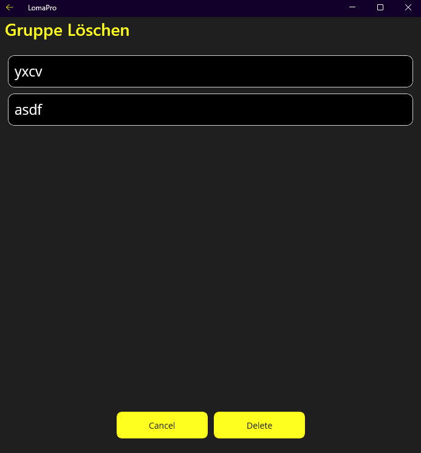

# Pflichtenheft

## Welche Softwarevoraussetzungen werden benötigt (mit Versionen)

### .net Version

.net 8

### Packages

    openmeteo.dotnet 2.0.0
    newtonsoft.json 13.0.3
    xamarin.essentials 1.8.1
    serilog.sinks.console 5.0.1
    microsoft.maui.controls.compatibility 8.0.7
    serilog.sinks.file 5.0.0
    serilog 4.0.0
    microsoft.maui.controls 8.0.7
    restsharp 110.2.0
    microsoft.extensions.logging.debug 8.0.0

## Funktionsblöcke bzw. Architektur

1.	MainPage: Die Hauptseite Ihres Projekts, die als Einstiegspunkt für die Benutzer dient. Sie enthält ein StackLayout, in dem dynamisch Bilder und Text hinzugefügt werden. Sie enthält auch Funktionen zum Lesen und Speichern von JSON-Daten sowie zum Navigieren durch die Bilder.
2.	Add_Holiday: Eine Seite, auf der Benutzer neue Urlaube hinzufügen können. Sie enthält ein Formular mit einem Bildauswahlfeld, Textfeldern und Kalenderelementen. Die eingegebenen Daten werden in JSON-Format gespeichert.
3.	Galary: Eine Seite, auf der Benutzer Bilder zu einem Urlaub hinzufügen können. Sie enthält eine Funktion zum Hinzufügen von Bildern, zum Lesen von JSON-Daten und zum Zeichnen von Bildern in einer ScrollView.
4.	Rechnung_Page: Eine Seite zur Verwaltung von Gruppen und Ausgaben. Sie enthält ein Grid mit dynamisch hinzugefügten Gruppen und Buttons zur Verwaltung von Ausgaben.
5.	NewBillPage: Eine Seite zum Hinzufügen neuer Ausgaben. Sie enthält ein Formular mit Eingabefeldern und Buttons zur Bestätigung oder Abbruch der Eingabe.
6.	NewGroupPage: Eine Seite zum Hinzufügen neuer Gruppen. Sie enthält ein Formular mit Eingabefeldern und einem Button zum Hinzufügen der Gruppe.
7.	RechnungAnsehenPage: Eine Seite zum Anzeigen der Rechnung. Sie enthält ein Grid mit dynamisch hinzugefügten Gruppen und einem Button zum Schließen der Rechnung.

## Detaillierte Beschreibung der Umsetzung

Mainpage:
Wir haben auf der Mainpage grundsätzlich nur ein Stacklayout abgesehnen von den weiterführenden Buttons. In das Stacklayout werden dann von der cs datei die Bilder mit dem Text hinzugefügt. Das passiert alles in der MakeCover() Funktion. Die Methode LoadCoversFromJson liest die JSON-Datei und deserialisiert den Inhalt in eine Liste von VacationCover-Objekten. Die Methode SaveJsonToFile speichert die JSON-Daten in eine Datei. Die Methoden LeftButtonClicked und RightButtonClicked werden zur änderung des Indexes des aktuellen Covers genutzt. 

Add_Holiday:
Ein Button ("+") ermöglicht es dem Benutzer, ein Bild auszuwählen, das in einem Image-Element als Vorschau angezeigt wird. In den Textfeldern kann man den Text eingeben. Mit den Kalender Elementen lässt sich das Start- Enddatum festlegen. Die Holidays werden dann zu den Covers und in JSON Format gespeichert. 

Galary:
Wenn man auf das Cover clickt kommt man in die Galary wo man bilder hinzufügen kann. Die Methode addImage öffnet einen Dateiauswahldialog, der es dem Benutzer ermöglicht, mehrere Bilder auszuwählen. Die Methode LoadImagesFromJson liest die JSON-Datei ein und deserialisiert sie zu einer Liste von Image_gal. Die Methode DrawImages durchläuft die Liste von Bildern und fügt sie dem ScrollView hinzu. Bei klicken der Bilder werden diese vergrößert.

Rechnung_Page: 
Sie ist die Hauptpage für das Rechnungs-feature, sie enthält ein ScrollView und besteht aus einem Grid. Die zweite Zeile enthält vier Buttons, die es dem Benutzer ermöglichen, eine Ausgabe hinzuzufügen, die Ausgaben anzusehen, eine Ausgabe zu löschen und eine Gruppe zu löschen. Die dritte Zeile enthält einen Button zum Schließen der Rechnung.

Rechnung_Page.xaml.cs: 
Sie lädt die Gruppen und Artikel aus JSON Dateien und updated die UI. Es gibt Funktionen zum Hinzufügen und Löschen von Gruppen und Artikeln und das Anzeigen von der Rechnung. Die Methode UpdateUI aktualisiert die Benutzeroberfläche, sie die Gruppen im Group StackLayout hinzufügt. Die Methoden LoadgroupsFromJson und LoadarticelsFromJson lesen die JSON-Dateien und deserialisieren sie in Listen von Group und Artikel. Die Methode SaveJsonToFile speichert die Daten in einer Datei.

NewBillPage.xaml: 
NewBillPage ist die UI für das Hinzufügen einer neuen Rechnugn. Sie besteht aus einem Grid, das in fünf Zeilen unterteilt ist. Die ersten beiden Zeilen enthalten jeweils ein Label und ein Eingabefeld für die Bezeichnung und den Betrag der Ausgabe.

NewGroupPage.xaml: 
Die NewGroupPage gibt dem Benutzer die möglichkeit eine neue Gruppe mit Namen und Personenanzahl hinzu zu fügen.

RechnungAnsehenPage.xaml: 
Sie besteht aus einem Grid, das in zwei Zeilen unterteilt ist. Die erste Zeile enthält eine ScrollView, in der die Gruppen dynamisch hinzugefügt werden. Die zweite Zeile enthält einen Button zum Schließen der Rechnung.

# Probleme und Lösung

|Problem|Lösung|
|Wie laden wir die Bilder / speichern wir sie im Projekt nochmal ab| Nur den Pfad gespeichert und darüber geladen|
|Serialiesieren|In Maui starten reele Pfade nicht bei der .exe sondern in /user/system32 welches das Serialisieren erschwerte|Es gibt zumindest für windows eine Möglichkeit den .exe Filepath herauszufinden|
|Richtiges skalieren der Bilder|Einfach probiert, schlussendlich in ein Imageframe gemacht und dann mit Aspect.AspectFit|
|Wie macht man die Bilder auf klick groß | Es gibt einen GestureRecognizer welcher erkennt ob man das Bild angeklickt hat |
|Richtiges laden der Bilder auf Android | Noch keine Lösung temporär auf eis gesetzt |
| Auswählen welche Gruppen/Artikel gelöscht werden sollten | Für beides eine neue Page mit einer Listbox |

# Testung

Wir haben die Software auf dem PC getestet und mit einem Android Smartphone und einem Emulator.

# Tutorial

Mit den grünen Pfeil-Buttons kann man zwischen den Covers wechseln.

Mit dem Delete-Button das Aktuelle Cover löschen.

Mit dem "+"-Button ein neues Cover erstellen:

Texte eingeben mit "+"-Button ein Bild hinzufügen, datum eingeben und Add drücken.

Auf das Bild Klicken um in die Galary zu kommen.

Auf "+"-Button drücken um Bild hinzu zu fügen.

Bild auswählen

Auf Bild Klicken um es zu vergrößern.

Auf Rechnung Klicken um weiter zu gehen.

Mit "+"-Button eine Gruppe erstellen die Anzahl der Personen und einen Namen vergeben.

Mit Ausgabe hinzufügen kann man eine Rechnung Hinzufügen. 

Gruppe und Ausgabe löschen einfach auswählen und löschen

